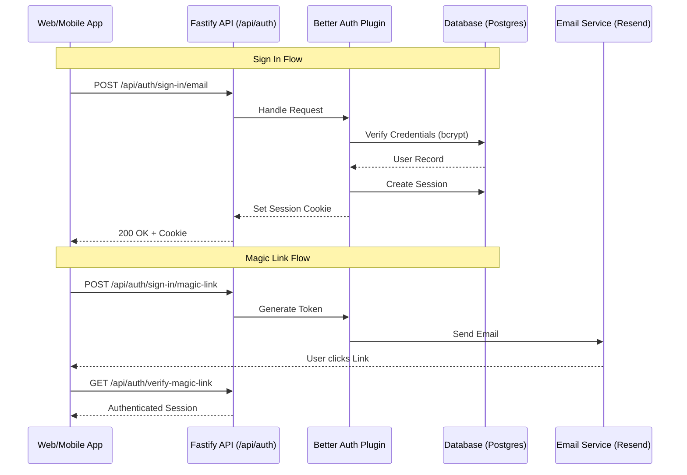

# Authentication & Authorization Capabilities

This document details the security architecture of the project, focusing on **Authentication** (identity verification) via **Better Auth** and **Authorization** (access control) via **Casbin**.

---

## 1. Authentication (Identity)

The project uses **Better Auth**, a comprehensive, self-hosted authentication solution that provides enterprise-grade features without vendor lock-in.

### Key Capabilities

| Category | Features |
| :--- | :--- |
| **Core Methods** | Email/Password (bcrypt), Social (GitHub, Google), Magic Links, Phone Number (OTP), Anonymous |
| **Security** | Two-Factor Authentication (2FA), Passkeys (WebAuthn), Session Management (Multi-device) |
| **Enterprise** | **Multi-Tenancy (Organizations)**, SSO (OIDC/SAML), Impersonation, Admin Dashboard |
| **API Access** | Bearer Tokens, API Keys (User-scoped) |

### Architecture

The authentication system is modularized in `@workspace/auth` and exposed via the API.



### Implementation Details

*   **Package:** `packages/auth`
*   **Configuration:** `packages/auth/src/index.ts`
*   **Database Adapter:** Drizzle ORM (`packages/db`)
*   **Frontend Client:** `apps/web/lib/auth.ts` (Auto-generated client)

#### Usage Example (Frontend)

```typescript
import { signIn, useSession } from "@/lib/auth";

export function LoginPage() {
  const session = useSession();

  const handleLogin = async () => {
    await signIn.email({
      email: "user@example.com",
      password: "password123",
      callbackURL: "/dashboard"
    });
  };

  if (session.data) return <div>Welcome, {session.data.user.name}</div>;
  return <button onClick={handleLogin}>Sign In</button>;
}
```

---

## 2. Authorization (Access Control)

The project uses **Casbin**, a powerful authorization library, to implement a **Multi-Tenant RBAC** (Role-Based Access Control) system with **Deny-Override** logic.

### Key Capabilities

*   **Multi-Tenancy:** Permissions are scoped to specific Organizations (Tenants) and Applications.
*   **Hybrid Logic:** Combines Database lookups (User → Role) with Policy evaluation (Role → Permission).
*   **Caching:** High-performance caching (Redis/Memory) for authorization checks.
*   **Audit Logging:** Tracks all permission denials for security auditing.
*   **Resource Ownership:** Native support for "Owner" checks (e.g., "User can edit their *own* post").

### Architecture

The authorization logic is encapsulated in the `authorization` Fastify plugin (`apps/api/src/plugins/authorization.ts`).

```mermaid
flowchart TD
    Request[API Request] --> AuthCheck{Authenticated?}
    AuthCheck -- No --> 401[401 Unauthorized]
    AuthCheck -- Yes --> Authz[Authorize(User, Org, Resource, Action)]

    subgraph Authorization Plugin
        Authz --> CacheCheck{Cache Hit?}
        CacheCheck -- Yes --> Result
        CacheCheck -- No --> DBLookup[DB: Get User Role]

        DBLookup --> RoleFound{Role Found?}
        RoleFound -- No --> Deny[Deny Access]
        RoleFound -- Yes --> Casbin[Casbin Enforcer]

        Casbin --> Policies[Load Policies (casbin_rules)]
        Casbin --> Evaluate[Evaluate: (User, Role, Tenant, Resource, Action)]
        Evaluate --> Audit[Audit Log (if denied)]
        Audit --> CacheStore[Store in Cache]
        CacheStore --> Result
    end

    Result{Allowed?}
    Result -- Yes --> Handler[Execute Route Handler]
    Result -- No --> 403[403 Forbidden]
```

### Implementation Details

*   **Package:** `packages/authorization`
*   **Model:** `packages/authorization/src/model.conf`
*   **Plugin:** `apps/api/src/plugins/authorization.ts`

#### Policy Model
The system uses a `(sub, role, app, tenant, obj, act)` request structure.
*   **User Assignment:** Stored in `user_role_assignments` table (e.g., User A is "Admin" in Org B).
*   **Role Definitions:** Stored in `casbin_rules` table (e.g., "Admin" can "delete" "posts").

#### Usage Example (API Route)

```typescript
// apps/api/src/modules/posts/routes.ts

fastify.get("/posts/:id", async (req, reply) => {
  const { id } = req.params;
  const post = await postsService.getById(id);

  // Check permission: Can the user 'read' 'posts' in this org?
  const allowed = await req.server.authorize(
    req.user.id,
    req.tenantId, // e.g. from URL param or header
    "posts",
    "read",
    post.authorId // Optional: For owner-based checks
  );

  if (!allowed) {
    throw new ForbiddenError("You cannot view this post");
  }

  return post;
});
```

---

## 3. Comparison & Synergy

| Feature | Authentication (Better Auth) | Authorization (Casbin) |
| :--- | :--- | :--- |
| **Purpose** | "Who are you?" | "What can you do?" |
| **Scope** | Global (User Identity) | Contextual (App + Org + Resource) |
| **Storage** | `users`, `sessions`, `accounts` | `user_role_assignments`, `casbin_rules` |
| **Integration** | `req.user` (populated by auth) | `req.server.authorize()` (uses `req.user`) |

### How They Work Together

1.  **Login:** Better Auth validates credentials and issues a session cookie.
2.  **Request:** Fastify receives a request. `fastify.auth` (Better Auth) validates the session and populates `req.user`.
3.  **Context:** The API determines the target Organization (Tenant) from the URL or headers.
4.  **Check:** The route handler calls `authorize(req.user.id, orgId, resource, action)`.
5.  **Enforcement:** The Authorization plugin resolves the user's role *within that specific organization* and checks if that role allows the action.
