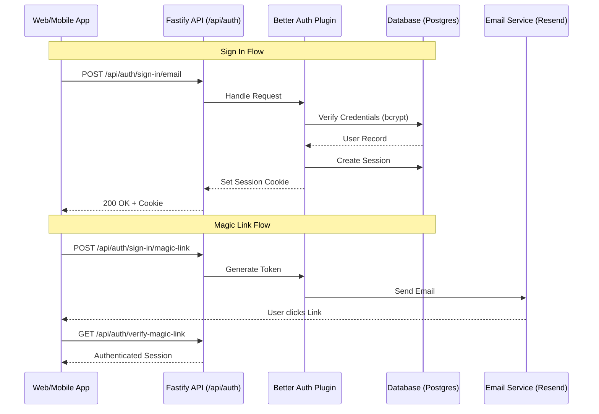

# Authentication & Authorization Capabilities

This document details the security architecture of the project, focusing on **Authentication** (identity verification) via **Better Auth** and **Authorization** (access control) via **Casbin**.

---

## 1. Authentication (Identity)

The project uses **Better Auth**, a comprehensive, self-hosted authentication solution that provides enterprise-grade features without vendor lock-in.

### Key Capabilities

| Category | Features |
| :--- | :--- |
| **Core Methods** | Email/Password (bcrypt), Social (GitHub, Google), Magic Links, Phone Number (OTP), Anonymous |
| **Security** | Two-Factor Authentication (2FA), Passkeys (WebAuthn), Session Management (Multi-device) |
| **Enterprise** | **Multi-Tenancy (Organizations)**, SSO (OIDC/SAML), Impersonation, Admin Dashboard |
| **API Access** | Bearer Tokens, API Keys (User-scoped) |

### Architecture

The authentication system is modularized in `@workspace/auth` and exposed via the API.



### Implementation Details

*   **Package:** `packages/auth`
*   **Configuration:** `packages/auth/src/index.ts`
*   **Database Adapter:** Drizzle ORM (`packages/db`) — uses PostgreSQL in production, SQLite for tests
*   **Frontend Client:** `apps/web/lib/auth.ts` (wrapper around `@workspace/auth/client`)

#### Usage Example (Frontend)

```typescript
import { signIn, useSession } from "@/lib/auth";

export function LoginPage() {
  const session = useSession();

  const handleLogin = async () => {
    await signIn.email({
      email: "user@example.com",
      password: "password123",
      callbackURL: "/dashboard"
    });
  };

  if (session.data) return <div>Welcome, {session.data.user.name}</div>;
  return <button onClick={handleLogin}>Sign In</button>;
}
```

---

## 2. Authorization (Access Control)

The project uses **Casbin**, a powerful authorization library, to implement a **Multi-Tenant RBAC** (Role-Based Access Control) system with **Deny-Override** logic.

### Key Capabilities

*   **Multi-Tenancy:** Permissions are scoped to specific Organizations (Tenants) and Applications.
*   **Hybrid Logic:** Combines Database lookups (User → Role) with Policy evaluation (Role → Permission).
*   **Caching:** High-performance caching (Redis/Memory) for authorization checks.
*   **Audit Logging:** Tracks all permission denials for security auditing.
*   **Resource Ownership:** Native support for "Owner" checks (e.g., "User can edit their *own* post").

### Architecture

The authorization logic is encapsulated in the `authorization` Fastify plugin (`apps/api/src/plugins/authorization.ts`).

```mermaid
flowchart TD
    Request[API Request] --> AuthCheck{Authenticated?}
    AuthCheck -- No --> 401[401 Unauthorized]
    AuthCheck -- Yes --> Authz[Authorize(User, Org, Resource, Action)]

    subgraph Authorization Plugin
        Authz --> CacheCheck{Cache Hit?}
        CacheCheck -- Yes --> Result
        CacheCheck -- No --> DBLookup[DB: Get User Role]

        DBLookup --> RoleFound{Role Found?}
        RoleFound -- No --> Deny[Deny Access]
        RoleFound -- Yes --> Casbin[Casbin Enforcer]

        Casbin --> Policies[Load Policies (casbin_rules)]
        Casbin --> Evaluate[Evaluate: (User, Role, Tenant, Resource, Action)]
        Evaluate --> Audit[Audit Log (if denied)]
        Audit --> CacheStore[Store in Cache]
        CacheStore --> Result
    end

    Result{Allowed?}
    Result -- Yes --> Handler[Execute Route Handler]
    Result -- No --> 403[403 Forbidden]
```

### Implementation Details

*   **Package:** `packages/authorization`
*   **Model:** `packages/authorization/src/model.conf`
*   **Plugin:** `apps/api/src/plugins/authorization.ts`

#### Policy Model
The system uses a `(sub, role, app, tenant, obj, act, resourceOwnerId)` request structure — 7 parameters to support owner-based permission checks.
*   **User Assignment:** Stored in `user_role_assignments` table (e.g., User A is "Admin" in Org B).
*   **Role Definitions:** Stored in `casbin_rules` table (e.g., "Admin" can "delete" "posts").

#### Usage Example (API Route)

```typescript
// apps/api/src/modules/posts/routes.ts

fastify.get("/posts/:id", async (req, reply) => {
  const { id } = req.params;
  const post = await postsService.getById(id);

  // Check permission: Can the user 'read' 'posts' in this org?
  const allowed = await req.server.authorize(
    req.user.id,
    req.tenantId, // e.g. from URL param or header
    "posts",
    "read",
    post.authorId // Optional: For owner-based checks
  );

  if (!allowed) {
    throw new ForbiddenError("You cannot view this post");
  }

  return post;
});
```

---

## 3. Comparison & Synergy

| Feature | Authentication (Better Auth) | Authorization (Casbin) |
| :--- | :--- | :--- |
| **Purpose** | "Who are you?" | "What can you do?" |
| **Scope** | Global (User Identity) | Contextual (App + Org + Resource) |
| **Storage** | `users`, `sessions`, `accounts` | `user_role_assignments`, `casbin_rules` |
| **Integration** | `req.user` (populated by auth) | `req.server.authorize()` (uses `req.user`) |

### How They Work Together

1.  **Login:** Better Auth validates credentials and issues a session cookie.
2.  **Request:** Fastify receives a request. `fastify.auth` (Better Auth) validates the session and populates `req.user`.
3.  **Context:** The API determines the target Organization (Tenant) from the URL or headers.
4.  **Check:** The route handler calls `authorize(req.user.id, orgId, resource, action)`.
5.  **Enforcement:** The Authorization plugin resolves the user's role *within that specific organization* and checks if that role allows the action.

---

## 4. Complex Implementation Example: Secure Document Management

This scenario demonstrates a complete end-to-end implementation of a **Secure Document Management** feature. It enforces:

*   **Organization-scoped access** (Tenants cannot see each other's documents).
*   **Role-based permissions** (Admins can delete, Viewers can only read).
*   **Resource ownership** (Members can edit *their own* documents but only view others).

### A. Database Schema (`packages/db/src/schema/documents.ts`)

```typescript
import { pgTable, text, timestamp } from "drizzle-orm/pg-core";

export const documents = pgTable("documents", {
  id: text("id").primaryKey(),
  orgId: text("org_id").notNull(),     // Tenant isolation
  authorId: text("author_id").notNull(), // Resource ownership
  title: text("title").notNull(),
  content: text("content"),
  status: text("status").default("draft"),
  createdAt: timestamp("created_at").defaultNow(),
});
```

### B. Authorization Policies (`packages/db/src/seed/index.ts`)

These rules define the capabilities for each role within an organization. Note the use of the `owner` condition for members.

| Role | App | Tenant | Resource | Action | Effect | Condition | Explanation |
| :--- | :--- | :--- | :--- | :--- | :--- | :--- | :--- |
| **admin** | app_default | * | documents | manage | allow | | Admins can do anything |
| **member** | app_default | * | documents | read | allow | | Members can read all docs |
| **member** | app_default | * | documents | create | allow | | Members can create docs |
| **member** | app_default | * | documents | update | allow | **owner** | Members can ONLY update *their own* docs |
| **member** | app_default | * | documents | delete | allow | **owner** | Members can ONLY delete *their own* docs |
| **viewer** | app_default | * | documents | read | allow | | Viewers can read all docs |

### C. Backend API Route (`apps/api/src/modules/documents/routes.ts`)

```typescript
import { FastifyInstance } from "fastify";
import { z } from "zod";

export async function documentRoutes(app: FastifyInstance) {
  // GET /v1/orgs/:orgId/documents/:docId
  app.get("/:orgId/documents/:docId", async (req, reply) => {
    const { orgId, docId } = req.params as any;
    const userId = req.user.id;

    // 1. Fetch Resource (to check existence and ownership)
    const doc = await app.db.query.documents.findFirst({
      where: (t, { eq, and }) => and(eq(t.id, docId), eq(t.orgId, orgId))
    });

    if (!doc) throw new NotFoundError("Document not found");

    // 2. Authorize Action
    // Checks: Can 'userId' with their role in 'orgId' perform 'read' on 'documents'?
    // Note: doc.authorId is passed for potential owner-based checks
    const allowed = await app.authorize(
      userId,
      orgId,
      "documents",
      "read",
      doc.authorId
    );

    if (!allowed) throw new ForbiddenError("Insufficient permissions");

    return doc;
  });

  // PATCH /v1/orgs/:orgId/documents/:docId
  app.patch("/:orgId/documents/:docId", async (req, reply) => {
    const { orgId, docId } = req.params as any;
    const userId = req.user.id;

    const doc = await app.db.query.documents.findFirst({
      where: (t, { eq, and }) => and(eq(t.id, docId), eq(t.orgId, orgId))
    });

    if (!doc) throw new NotFoundError("Document not found");

    // 2. Authorize Action
    // For a 'member' role, this only passes if (userId === doc.authorId)
    // because of the 'owner' condition in the policy.
    const allowed = await app.authorize(
      userId,
      orgId,
      "documents",
      "update",
      doc.authorId
    );

    if (!allowed) throw new ForbiddenError("You can only edit your own documents");

    // 3. Perform Update
    // ... update logic ...
    return { success: true };
  });
}
```

### D. Frontend Integration (`apps/web/app/(app)/documents/page.tsx`)

The frontend can conditionally render UI elements based on the user's role capabilities.

```tsx
"use client";

import { useSession } from "@/lib/auth";
import { useQuery } from "@tanstack/react-query";
import { api } from "@/lib/api-client"; // Typed API client

export default function DocumentPage({ params }: { params: { id: string } }) {
  const { data: session } = useSession();
  const { data: doc } = useQuery(api.documents.get.useQuery({
    params: { orgId: session?.activeOrganizationId, docId: params.id }
  }));

  if (!doc) return <div>Loading...</div>;

  // Simple permission check (can be abstracted into a hook)
  const isOwner = doc.authorId === session.user.id;
  const isAdmin = session.user.role === "admin";
  const canEdit = isAdmin || isOwner;

  return (
    <div className="p-4">
      <h1 className="text-2xl font-bold">{doc.title}</h1>
      <p>{doc.content}</p>

      {/* Conditionally render Edit button */}
      {canEdit && (
        <button className="bg-blue-500 text-white px-4 py-2 mt-4 rounded">
          Edit Document
        </button>
      )}

      {!canEdit && (
        <p className="text-gray-500 text-sm mt-4">
          Read-only view
        </p>
      )}
    </div>
  );
}
```
