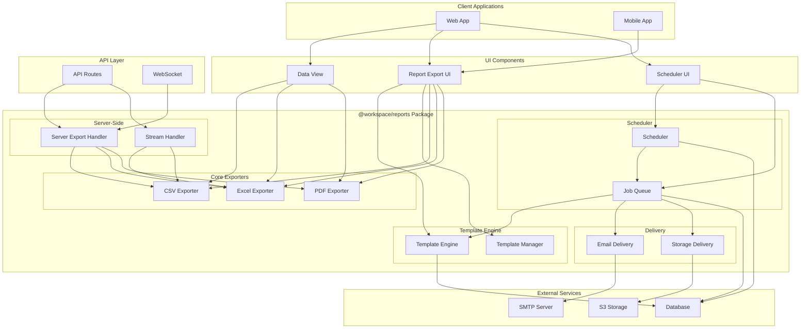
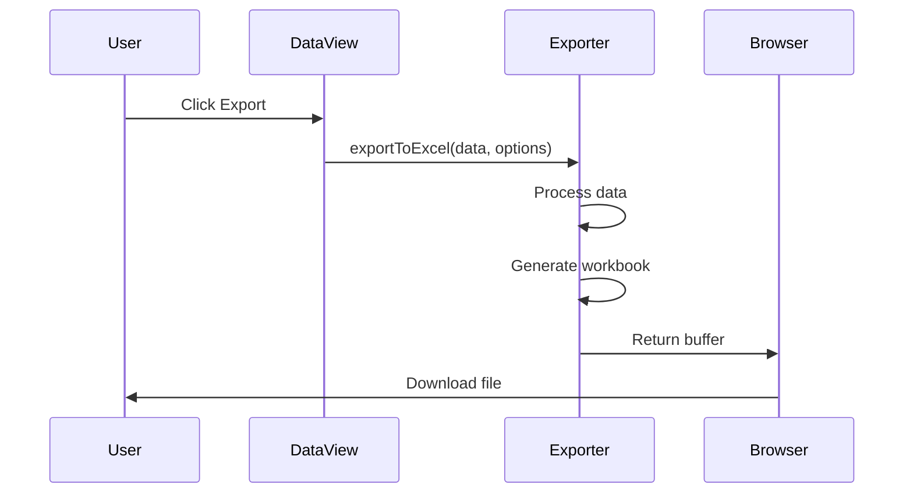
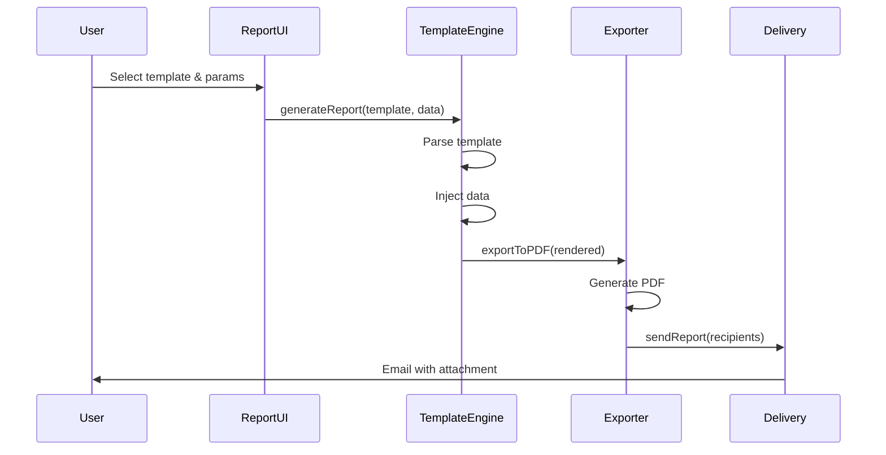
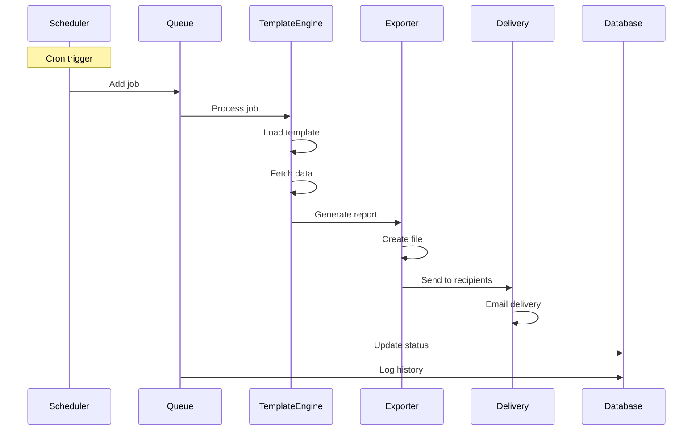
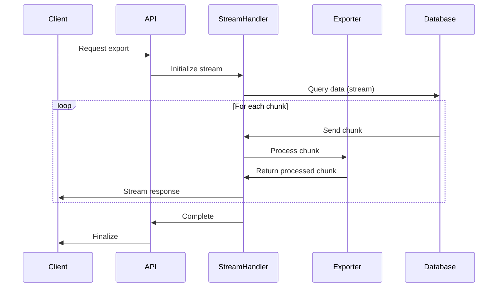
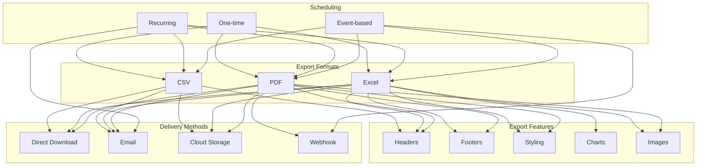
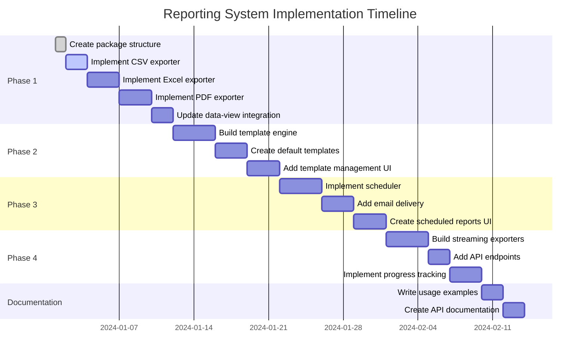

# Reporting System Architecture Diagram

## High-Level Architecture



## Data Flow: Simple Export



## Data Flow: Template-Based Report



## Data Flow: Scheduled Report



## Data Flow: Server-Side Export (Large Dataset)



## Package Dependencies

```mermaid
graph LR
    subgraph "Workspace Packages"
        UI[@workspace/ui]
        REPORTS[@workspace/reports]
        AUTH[@workspace/authorization]
        STORAGE[@workspace/storage]
    end

    subgraph "External Libraries"
        XLSX[xlsx]
        JSPDF[jspdf]
        HB[handlebars]
        BULL[bull]
        NODemailer[nodemailer]
    end

    UI --> REPORTS
    REPORTS --> XLSX
    REPORTS --> JSPDF
    REPORTS --> HB
    REPORTS --> BULL
    REPORTS --> NODemailer
    REPORTS --> STORAGE
    REPORTS --> AUTH
```

## Component Relationships



## Implementation Phases


